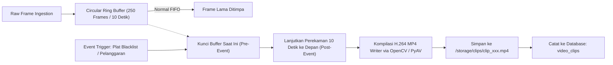

# Implementation Plan: Fitur Lanjutan Smart Vision AI CCTV Surveillance

> **Versi Dokumen:** 2.0.0  
> **Target Rilis:** Modul Enterprise, VMS & Keamanan Lanjut  
> **Status Dokumen:** Siap Dieksekusi (*Ready for Implementation*)  
> **Dokumen Terkait:** `implementation-plan.md` (Tahap 1–4)

---

## 1. Executive Summary & Sasaran Pengembangan

Dokumen ini merupakan rencana implementasi teknis untuk 3 kluster fitur utama pada sistem **Smart Vision AI CCTV Surveillance**:

1. **Kluster 1: Kontrol Dinamis Stream & Efisiensi AI (*Dynamic AI & Stream Lifecycle*)**
   - **Tombol Toggle Deteksi / Visual Overlay**: Pilihan tampilan video bersih (*Clean Raw Stream*) vs visualisasi AI lengkap (*HUD Bounding Box, Track ID, Contact Point, Counting Lines*).
   - **Mode Efisiensi AI (Per-Camera AI Inference Switch)**: Menghentikan kalkulasi YOLO & ByteTrack pada kamera tertentu tanpa memutus stream (menghemat hingga 80% beban komputasi CPU/GPU saat jam sepi).
   - **Tombol Aktifkan / Nonaktifkan Stream (Ingestion Suspension)**: Menghentikan *worker ingestion thread* dan konsumsi bandwidth RTSP/HLS tanpa menghapus data kamera dari basis data.

2. **Kluster 2: Perekaman Klip Video, VMS & Sinkronisasi Cadangan (*VMS, Clipping & Storage Sync*)**
   - **Event-Based Video Clipping**: Perekaman otomatis klip pendek MP4 (10 detik sebelum kejadian (*pre-buffer*) dan 10 detik sesudah kejadian (*post-buffer*)) saat terdeteksi plat buron (Blacklist) atau pelanggaran jalur.
   - **Timeline Playback Scrubber (24 Jam)**: Bilah penjelajah waktu terpadu dengan penanda warna (*color-coded event markers*) untuk memutar rekaman klip kejadian secara instan.
   - **Cloud & NAS Storage Synchronization**: Modul sinkronisasi latar belakang untuk mencadangkan bukti snapshot dan klip rekaman ke AWS S3/Cloudflare R2, Google Drive, atau NAS lokal (NFS/SMB/SFTP) disertai kebijakan pembersihan otomatis (*auto-purge*).

3. **Kluster 3: Manajemen Pengguna, Hak Akses Multi-Level & Audit Trail (*RBAC & Security*)**
   - **Role-Based Access Control (RBAC)**: Pembagian hak akses berjenjang berbasis JWT (**Admin**, **Operator / Satpam**, dan **Auditor**).
   - **Sistem Audit Trail & Log Aktivitas**: Pencatatan riwayat setiap aksi administratif (modifikasi kamera, perubahan garis virtual, pengeditan threshold, ekspor data, login/logout, dan penghentian sirene).

---

## 2. Arsitektur Komprehensif Sistem Lanjutan

```
                     ┌────────────────────────────────────────────────────────┐
                     │               Frontend Surveillance Web UI             │
                     │  (Live View, Timeline Scrubber, RBAC Guard, Audit Log) │
                     └───────▲────────────────────────▲────────────────▲──────┘
                             │                        │                │
                      REST API / JWT            WebSocket (/ws)   MJPEG Stream
                             │                        │        (?overlay=0/1)
                     ┌───────▼────────────────────────▼────────────────▼──────┐
                     │               FastAPI Application Gateway              │
                     │   [ Auth & RBAC Middleware ]  [ Audit Trail Interceptor]│
                     └───────┬────────────────────────┬────────────────┬──────┘
                             │                        │                │
              ┌──────────────┴──────────┐             │                │
              ▼                         ▼             ▼                ▼
   ┌──────────────────────┐  ┌──────────────────────┐  ┌──────────────────────┐
   │ Camera Control Unit  │  │ Ring Buffer & VMS    │  │ Storage Sync Worker  │
   │  - AI Inference Sw.  │  │  - Circular 10s Buf. │  │  - AWS S3 / MinIO    │
   │  - Stream Ingestion  │  │  - H.264 MP4 Clipper │  │  - Google Drive      │
   │    Suspend / Resume  │  │  - Timeline Indexer  │  │  - Local NAS (SMB)   │
   └──────────┬───────────┘  └──────────┬───────────┘  └──────────┬───────────┘
              │                         │                         │
              ▼                         ▼                         ▼
   ┌──────────────────────────────────────────────────────────────────────────┐
   │                  Database SQLite / PostgreSQL & Storage                  │
   │   (cameras, users, audit_logs, video_clips, events, system_settings)     │
   └──────────────────────────────────────────────────────────────────────────┘
```

---

## 3. Rincian Teknis Kluster 1: Kontrol Dinamis Stream & Efisiensi AI

### 3.1 Dual-Level AI Detection & Overlay Toggle

Sistem menyediakan 2 level kontrol:
1. **Level Klien (Visual HUD Toggle)**:
   - Pengguna dapat memilih melihat tayangan murni tanpa coretan kotak (*Clean Raw Feed*) atau dengan coretan AI (*Augmented HUD Feed*).
   - Diimplementasikan melalui query parameter pada endpoint stream:
     `GET /api/cameras/{id}/stream?overlay=true` (Default) vs `GET /api/cameras/{id}/stream?overlay=false`.
   - Pada `overlay=false`, frame video langsung di-encode ke JPEG tanpa melewati fungsi `_draw_overlays()`, menghasilkan tampilan bersih berkecepatan maksimal.
2. **Level Server (AI Inference Switch per Kamera)**:
   - Parameter baru pada tabel kamera: `ai_enabled` (Boolean, default `True`).
   - Jika `ai_enabled == False`:
     - Worker kamera tetap membaca frame dari RTSP/HLS (untuk Live Monitoring), tetapi **melewati (*bypass*) pemanggilan model YOLOv11 & ByteTrack**.
     - Penggunaan CPU/GPU berkurang drastis hingga **90%** untuk kamera tersebut.
     - Pengguna dapat menyalakan/mematikan tombol switch "⚡ AI Inference" di kartu kamera atau tabel pengaturan.

### 3.2 Ingestion Stream Lifecycle (Aktifkan / Nonaktifkan Stream)

- Parameter baru pada tabel kamera: `is_enabled` (Boolean, default `True`).
- Status operasional kamera:
  - `ONLINE`: Kamera aktif, streaming berjalan, inferensi AI aktif.
  - `AI_PAUSED`: Kamera aktif streaming, inferensi AI dinonaktifkan (mode hemat daya).
  - `DISABLED`: Kamera dinonaktifkan, koneksi RTSP/HLS diputus, *worker thread* dihentikan total.
- **Mekanisme Penonaktifan**:
  - Saat kamera diubah menjadi `is_enabled = False`:
    1. Endpoint API mengirim sinyal `worker.stop()`.
    2. `cv2.VideoCapture` ditutup (`cap.release()`), soket TCP RTSP/HLS diputus.
    3. Thread pekerja keluar (*terminated*), memori buffer dikosongkan.
    4. Tayangan pada Live View menampilkan placeholder visual *"STREAM DISABLED BY USER"*.
  - Saat diaktifkan kembali (`is_enabled = True`):
    1. Pipeline manager membuat worker baru dan menghubungkan kembali stream secara instan.

---

## 4. Rincian Teknis Kluster 2: Perekaman Klip Berbasis Event (VMS & Storage)

### 4.1 Rolling Frame Buffer & MP4 Clipper

Untuk mendapatkan rekaman **sebelum kejadian** (*pre-event*), sistem tidak bisa menunggu alarm terjadi baru mulai merekam. Oleh karena itu, diterapkan algoritma **Circular In-Memory Ring Buffer**:

$$\text{Kapasitas Buffer} = T_{pre} \times \text{FPS} = 10\text{ detik} \times 25\text{ FPS} = 250\text{ frame}$$



#### Spesifikasi Klip:
- **Format**: MP4 (Codec H.264 / AVC1).
- **Resolusi**: Menyesuaikan resolusi asli sumber kamera ($1280 \times 720$ atau $1920 \times 1080$).
- **Thumbnail**: Otomatis mengekstrak frame kunci (*frame saat trigger*) menjadi file `.jpg`.
- **Integrasi**: Link video klip dapat langsung disertakan dalam notifikasi Telegram (video file) atau diputar di web browser.

### 4.2 Interactive 24-Hour Timeline Playback (Unified Scrubber)

Antarmuka baru di tab **Video Playback & Arsip Rekaman**:
- **Bilah Scrubber Waktu Horizontal (00:00 - 23:59)**:
  - Memvisualisasikan 24 jam dalam format waktu lokal (WIB).
  - Skala waktu yang dapat di-zoom (1 Jam, 6 Jam, 12 Jam, 24 Jam).
- **Penanda Warna Kejadian (*Color Markers*)**:
  - 🔴 **Merah**: Deteksi Plat Blacklist / Alarm Keamanan.
  - 🟣 **Ungu**: Deteksi Plat Kendaraan Terbaca (ANPR).
  - 🟢 **Hijau**: Kendaraan / Orang Melintas Jalur Masuk (IN).
  - 🟡 **Kuning**: Kendaraan / Orang Melintas Jalur Keluar (OUT).
- **Interaksi Pemutar**:
  - Klik pada penanda waktu langsung memuat video klip kejadian tersebut.
  - Tombol kontrol: *Play/Pause*, *Speed (0.5x, 1x, 2x, 4x)*, *Next Event Jump*, *Unduh Berkas Klip*.

### 4.3 Cloud & NAS Storage Synchronization

Pencadangan otomatis dilakukan oleh modul independen `SyncWorker` di latar belakang:
- **Penyedia Penyimpanan yang Didukung**:
  1. **AWS S3 / Cloudflare R2 / MinIO**: Menggunakan pustaka `boto3`.
  2. **Google Drive**: Menggunakan Google Drive REST API v3 dengan Service Account credentials JSON.
  3. **NAS Lokal / Remote Server**: Protokol SMB/CIFS (`smbprotocol`) atau SFTP (`paramiko`).
- **Aturan Sinkronisasi (*Sync Policy*)**:
  - *Immediate Sync*: Klip event darurat (Blacklist) langsung diunggah dalam $\le 10$ detik setelah selesai direkam.
  - *Batch Nightly Sync*: Seluruh snapshot rutin dan log diunggah tiap pukul 02:00 dini hari.
- **Pembersihan Otomatis (*Auto-Purge / Retention*)**:
  - Menghapus berkas lokal yang telah berhasil disinkronkan ke cloud jika sisa ruang penyimpanan harddisk lokal berada di bawah ambang batas (misal: $< 15\%$).

---

## 5. Rincian Teknis Kluster 3: Manajemen Pengguna & Keamanan (RBAC & Audit Trail)

### 5.1 Skema Role-Based Access Control (RBAC)

Autentikasi menggunakan standar industri **OAuth2 dengan JWT (JSON Web Token)**:

| Hak Akses / Modul | Admin | Operator / Satpam | Auditor |
| :--- | :---: | :---: | :---: |
| **Live Multi-View & Status Kamera** | ✅ Lihat & Kontrol | ✅ Lihat Saja | ✅ Lihat Saja |
| **Bungkam Sirene / Respon Alarm** | ✅ Ya | ✅ Ya | ❌ Tidak |
| **Virtual Line Studio (Buat/Edit Garis)**| ✅ Ya | ❌ Tidak | ❌ Tidak |
| **Traffic Analytics & Grafik** | ✅ Ya | ❌ Tidak | ✅ Ya |
| **Ekspor Laporan (Excel & PDF)** | ✅ Ya | ❌ Tidak | ✅ Ya |
| **ANPR Registrasi (Whitelist/Blacklist)**| ✅ CRUD Penuh | ❌ Tidak | ❌ Read Only |
| **Kelola Kamera & Server Edge** | ✅ CRUD Penuh | ❌ Tidak | ❌ Tidak |
| **Lihat Audit Trail Pengguna** | ✅ Ya | ❌ Tidak | ✅ Ya |
| **Manajemen Akun Pengguna (Users)** | ✅ Ya | ❌ Tidak | ❌ Tidak |

### 5.2 Skema Tabel Database Baru

```sql
-- 1. Tabel Pengguna (Users)
CREATE TABLE users (
    id VARCHAR(36) PRIMARY KEY,
    username VARCHAR(50) UNIQUE NOT NULL,
    hashed_password VARCHAR(255) NOT NULL,
    full_name VARCHAR(100) NOT NULL,
    role VARCHAR(20) NOT NULL DEFAULT 'OPERATOR', -- ADMIN, OPERATOR, AUDITOR
    is_active BOOLEAN DEFAULT TRUE,
    created_at DATETIME DEFAULT CURRENT_TIMESTAMP
);

-- 2. Tabel Rekaman Klip Kejadian (Video Clips)
CREATE TABLE video_clips (
    id VARCHAR(36) PRIMARY KEY,
    camera_id VARCHAR(36) NOT NULL,
    event_type VARCHAR(50) NOT NULL, -- BLACKLIST_HIT, LINE_CROSS, MANUAL
    start_time DATETIME NOT NULL,
    end_time DATETIME NOT NULL,
    duration_sec FLOAT NOT NULL,
    file_path TEXT NOT NULL,
    thumbnail_path TEXT,
    cloud_synced BOOLEAN DEFAULT FALSE,
    cloud_url TEXT,
    created_at DATETIME DEFAULT CURRENT_TIMESTAMP,
    FOREIGN KEY (camera_id) REFERENCES cameras(id) ON DELETE CASCADE
);

-- 3. Tabel Log Audit Aktivitas Pengguna (Audit Trail)
CREATE TABLE audit_logs (
    id VARCHAR(36) PRIMARY KEY,
    user_id VARCHAR(36),
    username VARCHAR(50) NOT NULL,
    action_type VARCHAR(50) NOT NULL, -- CREATE, UPDATE, DELETE, TOGGLE, EXPORT, ACKNOWLEDGE, LOGIN
    entity_name VARCHAR(50) NOT NULL, -- CAMERA, VIRTUAL_LINE, SERVER_CONFIG, REGISTRY, ALARM
    entity_id VARCHAR(50),
    ip_address VARCHAR(45),
    description TEXT NOT NULL,
    timestamp DATETIME DEFAULT CURRENT_TIMESTAMP
);
```

---

## 6. Rencana Tahapan Eksekusi (Step-by-Step Implementation)

### Tahap 1: Dynamic AI & Stream Lifecycle Control
1. **Database Migration**: Tambahkan kolom `is_enabled` (boolean, default True) dan `ai_enabled` (boolean, default True) pada tabel `Camera`.
2. **Backend Engine**:
   - Modifikasi `CameraPipelineWorker` di `pipeline_manager.py` untuk memeriksa `ai_enabled` sebelum memanggil `detector.detect_and_track()`.
   - Modifikasi `stream_camera` di `cameras.py` untuk menerima query parameter `?overlay=true/false`.
   - Tambahkan endpoint API:
     - `PATCH /api/cameras/{id}/toggle-stream`: Mengaktifkan/menonaktifkan ingestion.
     - `PATCH /api/cameras/{id}/toggle-ai`: Menyalakan/mematikan pemrosesan AI.
3. **Frontend UI**:
   - Tambahkan switch toggle *"Overlay AI"* di setiap kartu player video di Live View.
   - Tambahkan switch toggle *"Aktifkan Stream"* dan *"Inferensi AI"* pada tabel Kelola Kamera.

### Tahap 2: Video Clipping Buffer & VMS Playback
1. **Engine Buffer**: Implementasikan class `RollingFrameBuffer` di `backend/app/engine/vms/ring_buffer.py` dengan deque berkapasitas 250 frame.
2. **MP4 Writer Service**: Buat `ClipRecorder` di `backend/app/engine/vms/clipper.py` untuk mengemas frame pre-event dan post-event menjadi H.264 MP4.
3. **Integrasi Event**: Hubungkan `_on_crossing_event` dan `_trigger_anpr` untuk memicu `ClipRecorder` ketika ada event plat BLACKLIST.
4. **Endpoint API**:
   - `GET /api/clips`: Mengambil riwayat klip video dengan filter kamera & tanggal.
   - `GET /api/clips/{id}/stream`: Streaming berkas MP4 langsung ke browser.
   - `GET /api/clips/timeline?date=YYYY-MM-DD`: Data titik waktu penanda untuk scrubber 24 jam.
5. **Frontend UI**:
   - Buat tab baru: **Playback & Video Archive**.
   - Komponen interactive canvas scrubber 24 jam dengan penanda warna event.
   - Modal player pemutar klip rekaman dengan tombol download.

### Tahap 3: Cloud & NAS Storage Sync Worker
1. **Modul Sinkronisasi**: Buat `SyncManager` di `backend/app/engine/storage/sync_manager.py` (mendukung S3 / Google Drive / Local NAS).
2. **Konfigurasi Server**: Tambahkan field konfigurasi cloud sync pada form pengaturan server.
3. **Background Cron Task**: Jalankan sinkronisasi asinkron untuk klip dan snapshot dengan status `cloud_synced == False`.
4. **Endpoint API**:
   - `POST /api/storage/sync-now`: Memicu sinkronisasi manual.
   - `GET /api/storage/status`: Menampilkan persentase penyimpanan lokal dan status cloud sync.

### Tahap 4: Authentication, Multi-Level RBAC & Audit Trail
1. **Autentikasi & Password**: Implementasikan `passlib[bcrypt]` dan `python-jose` untuk JWT token.
2. **Middleware RBAC**:
   - Dependency FastAPI: `get_current_user`, `require_role(["ADMIN"])`, `require_role(["ADMIN", "OPERATOR"])`.
3. **Audit Trail Interceptor**:
   - Buat fungsi utilitas `log_audit_event(db, user, action, entity, entity_id, description, ip)` dan panggil pada setiap endpoint mutasi (POST, PUT, DELETE, PATCH).
4. **Frontend UI**:
   - Halaman/Modal Login sederhana dengan penyimpanan token di localStorage.
   - Adaptasi UI otomatis: Menu yang tidak berhak diakses oleh Operator/Auditor akan disembunyikan/dinonaktifkan secara otomatis.
   - Tab baru: **Audit Log & Keamanan Pengguna** untuk melihat audit trail riwayat pengubahan sistem.

---

## 7. Rangkuman Target Deliverable

| Fitur | Komponen Backend | Komponen Frontend | Hasil Akhir yang Dapat Diuji |
| :--- | :--- | :--- | :--- |
| **Toggle Overlay & AI** | Endpoint `/stream?overlay=...` & PATCH toggle | Switch toggle di kartu video & tabel kamera | Video bisa dilihat polos tanpa kotak AI; CPU server bisa dihemat saat jam sepi |
| **Stream Lifecycle** | Worker suspend/resume & socket release | Switch Status Kamera Online/Disabled | Mematikan stream memutus koneksi jaringan RTSP tanpa hapus data |
| **Event Video Clipping** | `RollingFrameBuffer` & MP4 Writer | Tab Playback & Player Modal | Klip video 20 detik (10s pre, 10s post) tersimpan otomatis saat ada alarm |
| **24h Timeline Scrubber** | API timeline events by date | Interactive HTML5 Canvas Scrubber | User bisa geser waktu 24 jam dan loncat ke titik waktu alarm dengan 1 klik |
| **Cloud/NAS Sync** | Background sync task (S3/Drive/NAS) | Pengaturan Cloud Storage di Tab Server | Bukti foto dan klip terunggah otomatis ke cloud/NAS sebagai cadangan |
| **RBAC & Audit Trail** | JWT Auth & Tabel `audit_logs` | Login screen, role gate, & Tabel Audit Log | Satpam hanya bisa monitor & respons alarm; Admin bisa audit siapa yang edit kamera |
